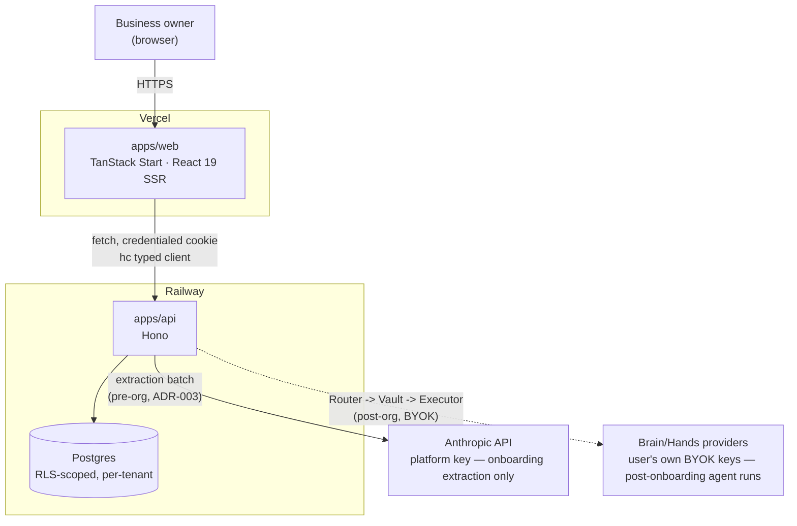
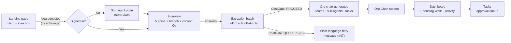
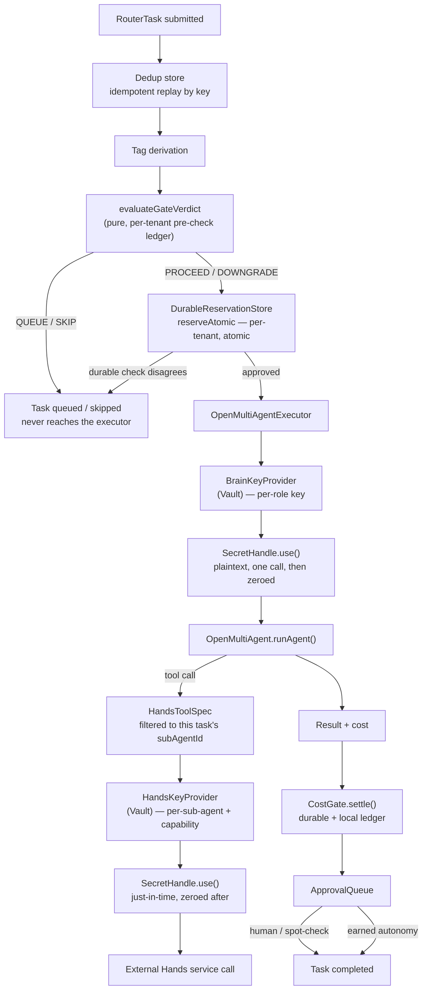
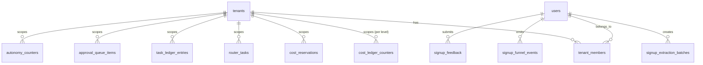
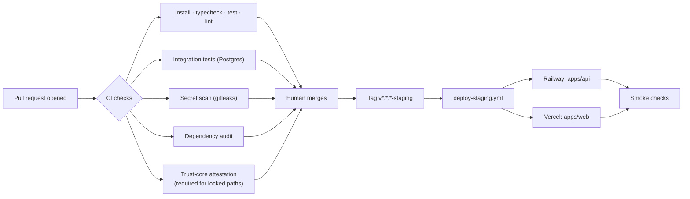

# Runwisely — System Architecture
**What's built, how the pieces fit together, and where the boundaries are**

> **Generated from repo state at commit `1f38bf7`** (main, 2026-08-09). This document is a snapshot,
> not a design doc — every diagram and table below traces to code, migrations, or merged PRs as of
> that commit. It **will go stale** as the system changes; regenerate it after any material
> architecture change (a new package, a new deployable, a new migration, a trust-core redesign)
> rather than hand-patching it indefinitely. Companion to
> [`security-architecture.md`](./security-architecture.md), which owns the threat model and key
> lifecycle in depth — this document owns the shape of the system as a whole.

---

## 1. What the product does

A visitor types their business idea into the landing page. If they sign up, an interview collects a
handful of structured answers, a platform-funded extraction batch turns that into an org chart of
teams and sub-agents (**Brains** = the LLM reasoning, **Hands** = the external service APIs an agent
can act through), and from there the business runs on Runwisely's own infrastructure — every AI call
passes through a cost gate and, for anything consequential, a human approval queue.

- **Idea → org chart.** Interview answers get matched against six business templates (ecommerce,
  service, SaaS, content, local, physical-space) and extracted into teams, sub-agents, and tasks.
- **BYOK, enforced.** Every Brain key is per-role, every Hands key is per-sub-agent-and-capability,
  envelope encrypted, decrypted just-in-time into a self-zeroing handle, never logged.
- **Spend can't surprise you.** A fail-closed pre-call gate, a per-tenant durable ceiling, and a
  provider-side cap are three independent walls between the product and a runaway bill.

---

## 2. Deployment architecture

Two deployables, one shared Postgres. `apps/web` is a TanStack Start React app on Vercel;
`apps/api` is a Hono server on Railway. Staging deploys are tag-triggered (`v*.*.*-staging`) and
gated behind the full CI suite.

**Why two separate AI-call paths.** Onboarding extraction (the interview → org chart step) happens
*before* a tenant exists, so it runs on a capped platform key (ADR-003) — a bot signing up costs the
platform cents, never dollars. Every AI call *after* the org chart exists runs on the tenant's own
key, pulled from the vault per call and gated by the same cost ceiling, now scoped to that tenant
specifically.

**Deploy pipeline note:** the Railway project has more than one service — Railway's GitHub
integration auto-detects one per `package.json` it finds in the monorepo, which is why services like
`@byok/router` (a library, not a deployable) sometimes appear in the Railway dashboard and fail
healthchecks if left running. `railway.json` at the repo root and `deploy-staging.yml`'s
`RAILWAY_SERVICE` env var both explicitly scope the real deploy to `@byok/api` only.

---

## 3. Product user flow

From a cold landing-page visit to a running dashboard. The idea itself survives sign-up — typed
before auth, persisted through it, and handed to the interview the moment a session exists.

---

## 4. Trust core — how a task actually runs

This is the part with a human-review gate on every merge (ADR-012). A task enters through
`Router.submitTask` and passes through dedup, tagging, the cost gate, the executor, and the approval
queue — in that order, with no shortcuts.

### Key packages in this path

| Package | Role | Notable pieces |
|---|---|---|
| `@byok/router` | Dispatch, dedup, ledger, tool-use executor | `Router` · `OpenMultiAgentExecutor` · `handsTool.ts` · dedup/ledger stores |
| `@byok/vault` | Envelope-encrypted key storage, JIT decryption | `Vault` · `SecretHandle` · `BrainKeyProvider` · `HandsKeyProvider` · `DekStore` |
| `@byok/cost-gate` | Fail-closed pre-call spend gate, per-tenant + durable | `CostGate` · `evaluateGateVerdict` · `DurableReservationStore` · `PostgresReservationStore` |
| `@byok/approval-queue` | Final human firewall before any effect fires | `ApprovalQueue` · `AutonomyEngine` · `EffectExecutor` · `denyList` |
| `@byok/agents` | Extraction pipeline + contracts | `extraction/pipeline.ts` · `templateSelect` · contracts (`Charter`, `OrgChart`) |

---

## 5. Security architecture (summary)

Five principles every trust-core design decision traces back to — full detail in
[`security-architecture.md`](./security-architecture.md).

1. **Fail closed.** Any safety component down or uncertain — estimator, validator, vault — work QUEUES.
2. **Least privilege, everywhere.** Every agent/service/key has the minimum scope its task needs, granted just-in-time.
3. **Isolation lives in the orchestration layer.** Tenants, agents, and tasks are separated by construction.
4. **A human approves everything irreversible.** Money movement, external sending, deploys, key operations never earn autonomy.
5. **Content is data, not instructions.** Anything an agent ingests can never rewrite what the agent is or does.

**Recently closed threat-model gaps:**

- **T8 — data exfiltration via Hands tools (#37).** Hands tools are now filtered to the running
  task's own sub-agent before the LLM ever sees them, on top of the vault's AAD scope-binding — a
  hijacked agent can't see, let alone call, another sub-agent's tool.
- **T4 — runaway spend (#47).** The cost ceiling is now a real per-tenant, durable cap — a fresh
  process after a restart or a concurrent replica can no longer re-open budget the durable store
  already recorded as spent.

**Isolation model — three nested rings:**

| Ring | Scope | Enforcement |
|---|---|---|
| 1 — Tenant | Row-level isolation at the data layer | Per-tenant DEKs, tenant ID on every queue job and audit row |
| 2 — Agent | Own immutable system prompt per dispatch | Own memory store, own Hands scopes, own Brain assignment |
| 3 — Task | Cross-team handoffs | Travel as a structured task object — the receiving agent never sees the sender's history |

---

## 6. Data model

Five migrations so far. Auth/tenancy tables are Better-Auth-managed; trust-core state (reservations,
tasks, approvals) and the pre-org signup funnel are Runwisely's own.

| Migration | Adds |
|---|---|
| `0001_init` | Core tenancy — `tenants`, `users`, `tenant_members` |
| `0002_durable_storage` | Trust-core durable state — `cost_ledger_counters`, `cost_reservations`, `router_tasks`, `task_ledger_entries`, `approval_queue_items`, `autonomy_counters`, `paused_batches`, `audit_log` |
| `0003_better_auth` | Better Auth's own schema — `account`, `session`, `organization`, `member`, `invitation`, `two_factor`, `verification` |
| `0004_signup_extraction_batches` | `signup_extraction_batches` — the pre-org idea → org-chart pipeline's own record |
| `0005_signup_metrics` | `signup_funnel_events`, `signup_feedback` — funnel analytics + post-signup feedback |

Row-level security enforces tenant isolation at the Postgres layer itself
(`packages/db/src/verifyRlsIsolation.ts`), not just in application code — Ring 1 of the isolation
model, made structural.

---

## 7. Frontend — apps/web

One TanStack Start app carrying both the public marketing site and the authenticated product — a
shared design-token system (`tokens.css`) and a shared `IdeaForm` component connect the two.

**Marketing site** (`components/landing/`): Hero + HeroPanel · ScrollSequence (scroll-scrubbed
narrative) · InteractivePreview · ProductStory · ByokExplainer · ValueComparison · ControlSafety ·
SpendingWalls · DashboardPreview · HowItWorksPage · PricingPage · NetworkIllustration (shared SVG,
reused across hero + app) · LandingNav / LandingFooter.

**App screens** (`components/`): AuthShell (sign-in/up) · SignupScreen · OnboardingScreen ·
InterviewScreen · OrgChartScreen · DashboardScreen · TaskListScreen — each with its own test file
and a matching route under `routes/`.

**Routes** (`apps/web/src/routes/`): `index` (landing) · `login` · `signup` · `onboarding` ·
`interview` · `org-chart` · `dashboard` · `tasks` · `how-it-works` · `pricing` · `styleguide` — plus
a shared `__root` shell.

Bundle budget: initial JS stays under 150KB gzipped, enforced in CI (`check-bundle-size.mjs`) after a
real production `vite build`.

---

## 8. Monorepo package map

🔒 = CODEOWNERS-locked (trust-core, human-review-gated per ADR-012).

| Path | What it is |
|---|---|
| `apps/web` | TanStack Start frontend — marketing site + authenticated app |
| `apps/api` 🔒 | Hono API — routes, auth middleware, tenant/user scoping, trust-core wiring |
| `apps/router` 🔒 | Task dispatch: dedup → tag → cost-gate → executor → approval-queue |
| `packages/vault` 🔒 | Envelope-encrypted Brain/Hands key storage, audit log, `SecretHandle` |
| `packages/cost-gate` 🔒 | Fail-closed spend gate — estimator, ceilings, durable per-tenant reservations |
| `packages/approval-queue` 🔒 | Human-review firewall, autonomy engine, effect executor, deny list |
| `packages/db` 🔒 | Postgres connection, migrations, RLS verification, durable stores |
| `packages/agents` | Extraction pipeline (interview → org chart) + shared Charter/OrgChart contracts |
| `packages/templates` | Six business templates — ecommerce, service, SaaS, content, local, physical-space |
| `packages/auth` | Better Auth configuration, step-up (MFA) policy |
| `packages/jobs` | Background job queue/worker scaffolding |

---

## 9. CI / release pipeline

`Trust-core attestation` is ADR-012's replacement for a normal approving review — unsatisfiable with
a single-account repo. It scans the PR description for a literal `TRUST-CORE REVIEWED: <maintainer>`
line whenever a trust-core path changed, and only the maintainer ever writes it.

---

## 10. Status at this snapshot

Most recent work first — see each package's own CHANGELOG-equivalent (PR history) for full detail.

- **PR #92 (merged)** — Per-tenant, durable cost ceiling. `CostGate` now scopes every ceiling to a
  `tenantId` and enforces it through the previously-unwired `DurableReservationStore`. Fixes #47.
- **PR #91 (merged)** — Verified Hands connection registry. `docs/design/tool-registry.md` extended
  against every provider's current docs — auth, gating, capability, cost, reliability, cited.
- **PR #90 (merged)** — Tool-use-capable executor + Hands/Brain key providers. Fixes #37.
- **PR #87–89 (merged)** — Final UI fidelity pass against the reference design.
- **#38 (in progress)** — Org-chart → tenant handoff.
- **#15 (planned)** — BYOK connect screen, informed by the connection registry research.
