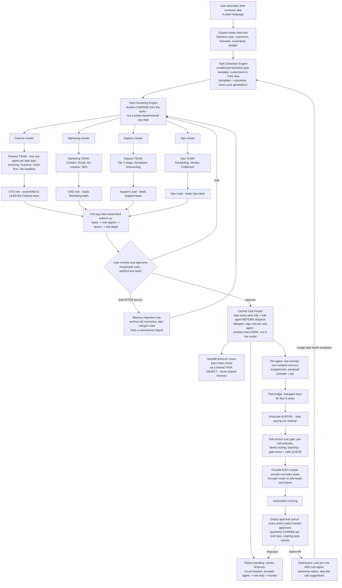

# Runwisely — Master Plan
**360° analysis · build plan · MVP ladder · architecture · security & efficiency protocols**
*Version 1.0 — July 2026*

---

## 1. The Idea (one paragraph)

A user describes their business idea in plain language. The system reverse-engineers it **from the bottom up**: it extracts every granular task the business actually needs done, assembles one sub-agent per task type, groups those sub-agents into functional **teams**, and only then creates the **role** (CFO, CMO, Support Lead, etc.) to lead each team — so the org chart is derived from the idea itself, never guessed top-down. The user reviews and approves the org chart. Each role and sub-agent then gets its own isolated system prompt, isolated memory, scoped tool permissions, and a BYOK-connected AI provider, all coordinated by a central task router that prevents overlap and duplicate cost. Every agent action starts human-approved; autonomy is earned per task type. Optionally, a build/deploy layer (per-user GitHub repo + staged cloud deploys) stands up the actual product behind sandboxed, human-approved pipelines. Cost stays radically low through fail-closed spend gates, model tiering, batching, caching, and skip-the-call analytics — and because the user brings their own keys, AI inference costs the platform $0.

**The one-line pitch:** *"Describe your business. We reverse-engineer the whole company — every task, every team, every role — and run it for you at cost."*

---

## 2. 360° Market Analysis

### 2.1 Market size and timing
- Purpose-built AI agent software spending is forecast at roughly **$206.5B in 2026**, up ~139% from 2025.
- Non-developer adoption of agents grew ~**137x since August 2025** — the shift to non-technical users is happening now, not a future bet.
- **SMBs are already the largest sub-segment** of the AI agents market.
- Timing verdict: the window is open but will not stay open long — incumbents are pivoting fast (see Lindy's early-2026 repositioning below).

### 2.2 Competitive landscape (verified July 2026)

| Competitor | Pricing (July 2026) | Model | Fatal gap we exploit |
|---|---|---|---|
| **Sintra** | $39/mo single helper, $97/mo all 12 (sale pricing to ~$15.60/mo annual); 250 credits/mo on **every** tier | 12 preset "AI helpers," credit-metered | **No execution** — drafts only; user copy-pastes output elsewhere. Helpers stop working when credits run out. Preset roles, not derived from the user's business. No free tier. |
| **Lindy** | Plus $49.99 / Pro $99.99 / Max $199.99; free plan **dropped** in early-2026 pivot | Agent builder → pivoted to AI executive assistant; credit-metered | Billing-surprise complaints dominate reviews (Trustpilot ~1.7/5 as of July 2026, incl. $550 overage reports); large-model steps cost 3–10x and model choice itself is gated to Pro+; ~$1,500 enterprise onboarding fee not on pricing page. |
| **Dume** | Free tier, paid from $8/mo; user picks the model | One assistant, real execution, model choice | Closest in spirit — but still **marks up AI cost through its own credits** rather than passing it through. One assistant, not an org structure. |
| **Relevance / MindStudio / builder tools** | Varies | DIY agent builders | Require the user to design the agents — exactly what non-technical SMB owners cannot and will not do. |

### 2.3 The white space (confirmed)
No current player combines **all four** of:
1. **True BYOK cost pass-through** (user pays provider directly, zero markup — vs. everyone's opaque credits)
2. **Real execution** (not draft-only like Sintra)
3. **Bottom-up derived org structure** (tasks → sub-agent teams → roles, generated from *this user's* idea — vs. 12 preset helpers)
4. **Genuinely guided non-technical onboarding** (interview → org chart → approve, vs. blank builder canvas)

The competitor pain we position against writes itself: Sintra users pay for drafts they still have to execute manually; Lindy users get billing surprises and pay a "model tax." Our pitch: *transparent cost, real work, your actual company structure.*

### 2.4 Honest risks (unchanged, restated plainly)
- **Scope risk:** merging agent-ops + build/deploy in one product is ambitious. Mitigation: deploy layer is deferred to MVP-3 (Section 8).
- **Extraction quality risk:** the org chart is only as good as task extraction. Mitigation: template-plus-customize, never pure generation (Section 9, node B).
- **BYOK onboarding cliff:** non-technical users must create provider accounts and paste API keys. Mitigation: managed-key trial bridge — value first, keys after (Section 8, MVP-1).
- **Fast-follower risk:** the moat is the router + templates + earned-autonomy data, not any single feature. Speed to design partners matters more than feature count.

---

## 3. Target User Base

| Segment | Profile | Why they buy | Entry tier |
|---|---|---|---|
| **Pre-launch founders** | Has an idea, no company yet | The org chart *is* the business plan — instant clarity on what running this idea actually takes | Free → Starter |
| **Solo operators / solopreneurs** | Running a 1-person business, drowning in ops | Offload finance/support/marketing to teams that actually execute | Starter → Pro |
| **Micro-SMBs (2–10 people)** | Small team, no budget for specialists | A CFO team + CMO team for less than one freelancer hour/month of AI cost | Pro |
| **Agencies / consultants** | Manage multiple client businesses | One workspace per client, per-client cost transparency they can invoice against | Agency |

Rough sizing (assumption-labeled, for planning only): tens of millions of SMBs in North America alone; serviceable early market = English-speaking solo operators and micro-SMBs already paying for at least one AI tool (Sintra alone demonstrates demand at $97/mo for less capability). Beachhead goal: **not** market share — **100 paying design-partner-quality users** whose usage data trains the templates and autonomy thresholds.

---

## 4. Cost Structure (per active user, under BYOK)

| Line item | Monthly cost |
|---|---|
| Hosting / compute (router, queue, DB, dashboard) | ~$0.80–2.00 |
| KMS + key-vault operations | ~$0.10–0.25 |
| Notifications (email/push) | ~$0.10–0.30 |
| Payment processing (blended) | ~$0.50–1.30 |
| Support amortized | ~$0.20–0.50 |
| **AI inference** | **$0.00 (user's own keys)** |
| **Total platform COGS** | **~$1.70–4.35 / active user / month** |

**Exception:** trial-bridge users (managed keys, first N tasks) cost the platform real inference — budget ~$0.50–1.50 per trial user, hard-capped per account, treated as CAC not COGS.

Gross margin at $12–29/mo pricing: **~85–92%.** This is the structural advantage credit-markup competitors cannot match without destroying their own revenue model.

---

## 5. Pricing & Revenue Expectations

### 5.1 Tiers
| Tier | Price | Includes |
|---|---|---|
| **Free** | $0 | Org-chart generation + 1 role with manual review on everything; managed-key trial for first N tasks |
| **Starter** | $12/mo | 3 roles + teams, BYOK, approval queue, cost dashboard |
| **Pro** | $29/mo | Unlimited roles, earned autonomy, batch scheduling, skip-the-call analytics |
| **Agency** | $79/mo | Multi-client workspaces, per-client cost reports, white-label dashboard |

Undercuts Sintra's full bundle ($97) and every Lindy tier while offering execution + transparency neither has. The free tier is the wedge Sintra and Lindy both abandoned — and the org chart alone is shareable/viral output.

### 5.2 Revenue scenarios (Year 1 from public launch; all assumptions explicit)

Assumptions: free→paid conversion 4% (conservative) / 7% (base) / 10% (optimistic); blended ARPU ~$24; monthly churn 6% / 4.5% / 3%; growth driven by organic + build-in-public + dogfooded CMO agent (Section 11).

| Scenario | Free signups (Yr 1) | Paying (end Yr 1) | MRR (end Yr 1) | ARR run-rate |
|---|---|---|---|---|
| Conservative | 5,000 | ~150 | ~$3.6K | ~$43K |
| Base | 12,000 | ~600 | ~$14.4K | ~$173K |
| Optimistic | 30,000 | ~2,200 | ~$53K | ~$634K |

Interpretation: Year 1 is not about revenue — at 85–92% margin even the conservative case covers infrastructure. Year 1 is about **template quality + autonomy data + testimonials**. Revenue inflects in Year 2 when Agency tier + the deploy layer (MVP-3) come online.

---

## 6. Repositories to Build On (verified real, July 2026)

| Repo / starter | Role in our stack | Why verified-fit |
|---|---|---|
| **open-multi-agent/open-multi-agent** (GitHub, npm `@jackchen_me/open-multi-agent`) | **The router's skeleton.** | TypeScript, model-agnostic (Claude/GPT/Gemini/DeepSeek/local = BYOK-native). Coordinator plans a task DAG at runtime; deterministic scheduler; runs are inspectable/approvable/replayable; `planOnly` mode maps directly onto our approve-the-org-chart gate; `maxCostBudget` + `estimateCost` map onto our fail-closed cost gate; built-in failure states (retry policy, FAILED surfacing, held dependents). |
| **SaaSWeave** (GitHub) | **The app shell.** | Production-oriented multi-tenant TypeScript monorepo: TanStack Start, Hono, oRPC, Drizzle, Better Auth, **BullMQ + Redis** (our job queue), one typed boundary. |
| **claude-flow** | Reference for multi-agent orchestration patterns in Claude Code | Study, don't fork. |
| **AY Automate Agent Framework Starter** | Reference for human-in-the-loop gates + file-based task coordination | Pattern source for the approval queue. |

Rule: **scaffolding, not product.** Fork the first two; read the last two.

---

## 7. Build Plan — Repository → Emergent → Deployment

### Phase A — Repository assembly (Claude Code, weeks 1–4)
1. Fork SaaSWeave → strip to shell (auth, multi-tenancy, BullMQ queue, Postgres).
2. Vendor open-multi-agent as the orchestration core; wrap it in our **Router service**: role/sub-agent tagging, task-object handoff, dedup check, per-sub-agent cost ledger.
3. Build the four precision components Claude Code owns end-to-end (these are the pieces no vibe-coding tool can be trusted with):
   - **Key vault** — envelope encryption via KMS, keys never in logs/env/client (Section 10.1)
   - **Fail-closed cost gate** — pre-call estimate, tier routing, queue-on-gate-down (Section 10.2)
   - **Approval queue + earned autonomy** — per task type, N-approvals threshold, spot-check sampler
   - **Task Extraction Engine v1** — 5 business-type templates + customize pass (never pure generation)
4. Repo hygiene from day one: monorepo (`/apps/web`, `/apps/router`, `/packages/agents`, `/packages/templates`), CI on every PR (build, tests, secret-scan, dependency audit), protected `main`, all deploys from tags.

### Phase B — Emergent upload (weeks 3–6, overlapping)
Emergent's multi-agent build approach owns the **commodity surface**, pointed at our repo — not a blank prompt:
- Import the Phase-A repository as the starting codebase.
- Emergent builds: dashboard UI (cost per role AND per sub-agent), onboarding interview flow, org-chart review/edit screen, approval-queue UI, billing (Stripe), notification plumbing, initial deploy pipeline.
- **Boundary rule (non-negotiable):** Emergent never touches `/apps/router`, the key vault, the cost gate, or the approval-queue logic. Those directories are CODEOWNERS-locked to human + Claude Code review. Emergent proposes; CI + human approve — our product's own Part-1 safety stack applied to building the product itself.

### Phase C — Deployment + mobile (weeks 6–10)
- Staging environment per the safety stack (Section 10.4): sandbox → automated checks → staging URL → plain-language summary → human approve → production.
- **Capacitor** wrap for iOS/Android (no current builder emits native binaries; every one needs this shell step). Push notifications = approval-queue alerts — the killer mobile use case: *approve your CFO's work from your phone.*

---

## 8. MVP Ladder

| MVP | Ships | Proves | Kill/advance criterion |
|---|---|---|---|
| **MVP-0** *(weeks 1–4)* | Org-chart generator only: idea → interview → tasks → sub-agent teams → roles → editable chart. Shareable output. No execution. | **The differentiation test:** does a weird business idea produce a weird org chart? If every idea converges on CFO/CMO/Support/Ops, extraction is pattern-matching, not reverse engineering — fix templates before building anything else. | 20 test users; ≥70% say the chart taught them something about their own idea. |
| **MVP-1** *(weeks 5–10)* | ONE role live (Support or Finance — whichever design partners want): full team of sub-agents, approval queue on every action, managed-key trial → BYOK graduation, cost dashboard per sub-agent. | Real execution + cost transparency = the two things no competitor has together. | 10 design partners; ≥5 graduate to BYOK; median cost per task visibly under a Sintra credit. |
| **MVP-2** *(months 3–5)* | Multi-role org with task-object handoffs, earned autonomy, batching, skip-the-call analytics, Agency workspaces. | The router — dedup, isolation, handoff — works across teams. | Paying users; churn < 6%/mo; ≥1 task type reaches earned autonomy per active user. |
| **MVP-3** *(months 6+)* | Deploy layer: per-user GitHub repo, staged deploys, full Section-10.4 pipeline. | The full "autopilot builds your product too" vision — **only after** the ops layer has paying users. | Gated on MVP-2 success. Do not build early. |

---

## 9. Architecture (v5 — bottom-up with teams)

*(Standalone file: `system-architecture-v5-bottomup-teams.mermaid`.)*

---

## 10. Security & Efficiency Protocols

### 10.1 Key security (the trust foundation — one leak ends the company)
- **Envelope encryption:** every user API key encrypted with a per-tenant data key, itself encrypted by a KMS master key. Plaintext keys exist only in router memory for the duration of a call.
- Keys **never** appear in logs, error messages, client-side code, analytics events, or LLM context. Automated secret-scan on every log pipeline, not just every commit.
- Scoped retrieval: only the router service account can decrypt; dashboard and Emergent-built surfaces see a masked fingerprint (`sk-...4f2a`) only.
- Instant revoke: one-click key removal purges vault entry + all queued tasks referencing it.
- Provider-side guidance at onboarding: we walk users through setting **provider-side spend limits** as the final backstop we cannot set for them.

### 10.2 User credit efficiency (the "no wastage" contract with users)
This is a product promise, enforced by five mechanisms in order:
1. **Fail-closed pre-call gate.** Every non-trivial call gets a cost estimate first. Over ceiling → downgrade tier, queue for batch, or skip with notification. Estimation service down → calls **queue**, never proceed blind. This gate is load-bearing: under BYOK a runaway loop hits the *user's* card, so it gets hard-stop treatment, not alerts.
2. **Tiered routing, cheap by default.** Tier 1 (Haiku-class) for categorization/lookups; Tier 2 for drafting; Tier 3 (frontier) only for high-stakes/strategic. Escalation on failed validation checks (schema/deterministic where possible — LLM self-confidence is not trusted alone), never "because a better model exists."
3. **Batch everything non-urgent.** Digests, bulk categorization, reports → Batch API (50% off, and concentrating calls in time is what makes prompt caching actually hit for sporadic SMB workloads). For our usage pattern, batching is lever #1.
4. **Per-task-type budget ceilings**, not just per-role — the dashboard shows *which line item* is eating budget, not a blended number.
5. **Skip-the-call analytics.** Surface patterns: "Support spent 60% of budget on repeated password-reset questions — add a canned response, skip the AI entirely." The cheapest call is no call.

**Target economics:** typical mid-size task ~$0.18 uncached → under $0.02 with the full stack. The dashboard shows users this delta explicitly — cost transparency *is* the marketing.

### 10.3 Workflow reliability (automation that keeps working)
- Retry policy per task type (transient errors retry; malformed input and budget exhaustion do not).
- Timeouts on every agent call; circuit-breaker trips a misbehaving agent and escalates agent → role lead → human.
- Dedup check before dispatch; cross-team work moves via the shared task object — memory isolation is never broken for a handoff.
- Health monitoring per sub-agent (success rate, latency, cost trend) feeds the dashboard; degradation alerts before users notice.
- Every run inspectable and replayable (inherited from the orchestration core) — debugging = replaying the exact run, not guessing.

### 10.4 Per-user GitHub repo + deployment rules (MVP-3 layer)
Each user-business that opts into the build layer gets its **own dedicated GitHub repository** (created via GitHub App with minimal scopes, owned/transferable to the user — their code is theirs, same philosophy as their keys). Every change passes the full stack in order:
1. Build agent runs in an isolated sandbox with **zero production credentials** — it can only propose into the pipeline.
2. Automated pre-checks: build success, generated smoke tests, secret-leak scan, dependency vulnerability scan. Fail any → never reaches staging.
3. **Staging always** — isolated preview URL, never straight to production.
4. **Plain-language change summary + explicit human approval.** No silent auto-deploy, ever, especially on early deploys.
5. Canary rollout *once traffic justifies it* (deferred until a user's app has real volume — 5% of 40 users is noise).
6. Automatic rollback on error-rate threshold — previous version always one step away.
7. **Hard resource ceilings** (max instances, max DB size) — a runaway bug hits a wall, not an unbounded bill.
8. Scheduled backups with **periodically tested restores**.
9. Full audit trail: every change is a real Git commit + deploy log — timestamped, attributable, reversible.

### 10.5 Platform viability protections (keeping *our* idea alive)
- **Tenant isolation:** row-level tenant scoping enforced at the data layer (inherited from the shell), per-tenant encryption keys, no cross-tenant queries possible by construction.
- **Abuse controls:** rate limits per tenant; trial-bridge inference hard-capped per account (fraud on managed keys is our cost, so it's capped like our own spend gate); anomaly detection on task volume.
- **Prompt-injection defense at the cascade point:** the CEO-master-prompt cascade and any content agents ingest (emails, tickets) are treated as data, not instructions — role prompts are immutable per dispatch, and tool scopes mean a poisoned support email can never touch the bank feed.
- **CODEOWNERS lock** on router/vault/gate/queue directories — no AI builder or contributor merges into the trust core without human review.
- **Routing table freshness:** provider pricing re-checked periodically; tier assignments re-optimized rather than hardcoded at launch.

---

## 11. Go-To-Market — Dogfooding as Proof

The launch CMO **is the product**: instantiate our own org (CMO role + Content/Social sub-agents) on the platform, feed the Founder role the master prompt — organic-led growth, build-in-public on Reddit/X, direct outreach to users publicly complaining about Sintra's draft-only limit and Lindy's billing surprises (both complaint streams are active and public as of July 2026), Product Hunt timed to MVP-2 feature-complete. Claim: **"our own product ran its own launch"** — specific, verifiable, and no competitor can copy it without having the product.

Secondary wedge: MVP-0's org chart is standalone shareable content — every generated chart is a growth asset ("here's the company my idea actually needs").

---

## 12. Success Metrics & Kill Criteria

| Stage | North star | Kill/pivot signal |
|---|---|---|
| MVP-0 | % users who say the chart changed their understanding of their idea | Charts converge to identical structures regardless of input → extraction isn't working; fix before proceeding |
| MVP-1 | BYOK graduation rate from trial bridge | <20% graduate → the onboarding cliff is unsolved; managed-key economics must change |
| MVP-2 | Task types reaching earned autonomy per active user; churn | Users never grant autonomy → approval fatigue; rework thresholds |
| MVP-3 | Deployed apps still live after 90 days | Gated entirely on MVP-2 paying traction |

**Standing rule:** the router, the templates, and the autonomy data are the moat. Anything that doesn't strengthen one of those three is scope creep.

---

*Companion files: `system-architecture-v5-bottomup-teams.mermaid` (standalone diagram), `deployment-safety-and-cost-routing.md` (detailed safety/cost source doc — note: duplicate Part 3 should be removed before sharing externally).*
