# BYOK Business Autopilot — Userflow, Role Catalog & API Key Guide
**The complete user journey · every recommended role and team · best AI per role · step-by-step key setup**
*Companion to the Master Plan — July 2026*

**The design law for everything in this document:** the user describes their idea once, and the system does the rest. Every screen either shows the user something, or asks for ONE decision. Never both jobs on one screen, never jargon, never a blank canvas.

---

## PART 1 — The Complete Userflow (screen by screen)

### Stage 1: Idea → Company (Day 1, ~10 minutes)

**Screen 1 — Landing / Sign up.**
One input box: *"Describe your business idea in a few sentences — like you'd tell a friend."* Sign up (email or Google) happens AFTER they type the idea, not before — the idea is the hook, the account is the formality.

**Screen 2 — Guided interview (max 6 questions, one at a time, tappable answers).**
1. What type of business is this? (auto-suggested from their description — they confirm or correct)
2. Who pays you? (consumers / businesses / both)
3. How do customers find you? (online / local / referrals / not sure yet)
4. Is anything already running? (nothing yet / side project / live business)
5. What do you dread doing most? (money stuff / marketing / customer messages / admin)
6. Rough monthly budget for AI help? ($10-ish / $25-ish / $50+ / whatever it takes)

Every answer sharpens task extraction. Question 5 decides which role goes live first in trial mode. Question 6 sets the default budget ceilings.

**Screen 3 — "Here's everything your business needs done."**
The extracted granular task list, grouped, in plain language ("Send invoices and chase late payments" — never "AR management"). User can check/uncheck/add tasks. This screen IS the reverse-engineering made visible — many users will screenshot it.

**Screen 4 — The org chart reveal (the magic moment).**
Animated bottom-up assembly: tasks slide into sub-agents → sub-agents group into teams → a role lead appears atop each team. Headline: *"Your idea needs a company of [N] roles running [M] tasks. Here it is."* Share button on this screen — every chart is a growth asset.

**Screen 5 — Review & approve.**
Tap any role to expand its team; merge, split, remove, rename. One primary button: **"Hire my team."**

### Stage 2: First Value — before any API key (Day 1, ~5 minutes)

**Screen 6 — Trial mode starts (managed keys, invisible to user).**
The role matching their "dread" answer goes live immediately on OUR keys. No API console, no billing setup, nothing technical. Copy: *"Your [Support Lead] is starting on their first 10 tasks — free, on us."*

**Screen 7 — The approval queue (their new home screen).**
Every completed task appears as a card: what the agent did, the output, plain-language reasoning, and two buttons — **Approve** / **Fix this** (with a comment box that becomes agent feedback). Mobile push: *"Your CFO finished 3 tasks — review when ready."* This screen teaches the core loop: **agents work, you approve, agents learn.**

**Screen 8 — The value receipt.**
After the trial tasks: *"Your team completed 10 tasks. Estimated time saved: ~2.5 hours. If you'd done this on [Competitor], it would have cost ~$X in credits. On your own keys it would have cost ~$0.19 total."* This screen sells the BYOK graduation.

### Stage 3: BYOK Graduation (Day 1–3, ~8 minutes, fully hand-held)

**Screen 9 — Provider choice, radically simplified.**
*"Your team needs an AI account to work from — like giving employees a company login. You pay the AI company directly, at cost. We never mark it up."* Three cards: **Anthropic (Claude)** — recommended default, one key covers all tiers; **OpenAI** — also complete coverage; **Google (Gemini)** — cheapest high-volume tier. A fourth expandable card for advanced users: add DeepSeek/others later. **Default recommendation: start with ONE provider. One key, tiering handles the rest.** (Full step-by-step guides: Part 3.)

**Screen 10 — In-app key walkthrough.**
Split screen: our instructions on the left (with screenshots per Part 3), the provider site opens on the right. The user pastes the key; we validate it live with a $0.0001 test call, show the masked fingerprint (`sk-...4f2a`), and confirm: *"Connected. Your key is encrypted and only your agents can use it. Revoke anytime with one tap."*

**Screen 11 — The safety net setup (mandatory, 2 taps).**
1. Our budget ceiling: *"Never let my whole team spend more than $___/month"* (prefilled from interview Q6).
2. Provider-side spend limit: we walk them through setting it on the provider's own dashboard — the backstop we cannot set for them. Skippable only after an explicit "I understand the risk" tap.

### Stage 4: Full Automation Running (Day 3 onward)

**Screen 12 — Connect tools (progressive, per agent, scoped).**
Each sub-agent requests only what it needs, in plain language: *"Your Invoicing agent wants to connect to Stripe — it will be able to read invoices and draft reminders. It can NEVER see your other tools."* Connect now or skip; agents without tools work in draft mode.

**Screen 13 — Your goals (the CEO master prompt, without calling it that).**
One box: *"What matters most this month?"* (e.g., "get first 10 customers", "get paid faster"). Cascades through the router to every role lead and team. Editable anytime; re-cascades on change.

**Screen 14 — Daily rhythm.**
Morning digest (push/email): what each team did, what's waiting for approval, spend so far this month vs. ceiling. The approval queue stays the home screen.

**Screen 15 — Earned autonomy prompts.**
After N approved outputs of one task type: *"You've approved your Expense agent's categorizations 15 times in a row. Let it run these automatically? You'll still get random spot-checks."* One task type at a time, always reversible, never for money-moving or externally-visible actions without an explicit second confirmation.

**Screen 16 — The dashboard.**
Cost and activity per role AND per sub-agent; autonomy status per task type; skip-the-call suggestions (*"60% of Support spend is the same password question — add this canned answer and save $4/mo"*); monthly "your team's payroll" report — total AI spend vs. what the same work costs on credit-based competitors.

**Screen 17 (MVP-3) — Build my product.**
For users whose idea needs software: the deploy layer, behind its own flow (own GitHub repo, staging preview, plain-language change summaries, explicit approval per deploy — full safety stack from the Master Plan §10.4).

### The whole flow as one diagram

```mermaid
flowchart LR
    A[Describe idea] --> B[6-question interview] --> C[Task list shown] --> D[Org chart reveal] --> E{Approve team?}
    E -->|Edit| C
    E -->|Hire my team| F[Trial: 10 free tasks<br/>on managed keys]
    F --> G[Approval queue<br/>learn the loop] --> H[Value receipt:<br/>time + cost saved]
    H --> I[BYOK graduation:<br/>guided key setup] --> J[Budget ceilings<br/>ours + provider-side]
    J --> K[Connect tools<br/>scoped per agent] --> L[Set monthly goals] --> M[Running: digest,<br/>approvals, dashboard]
    M --> N[Earned autonomy<br/>per task type] --> M
```

---

## PART 2 — The Complete Role Catalog

How to read it: **Tier 1** = cheap/fast (Claude Haiku class, GPT mini class, Gemini Flash class, DeepSeek) — high volume, low stakes. **Tier 2** = mid (Claude Sonnet class, GPT standard class) — drafting and reasoning. **Tier 3** = frontier (Claude Opus/flagship class, GPT flagship class) — strategy and high-stakes output. Exact model names shift every few months; the router's live routing table always holds current names and prices — these are the *class* assignments, which are stable. Autonomy defaults: 🔒 never autonomous · ⏳ earnable after N approvals · ✅ autonomous-eligible early.

### Universal roles (almost every business gets these)

**FOUNDER/CEO — the user themselves.** Not an agent. Their goals (Screen 13) cascade to everything. The one Tier-3 "Chief of Staff" sub-agent here drafts the weekly plan and flags cross-team conflicts — Claude frontier class recommended (strongest long-context synthesis across all teams' summaries). ⏳

**CFO — Finance team** *(default first-role for "money stuff" dreaders)*
| Sub-agent | Does | Tier / best AI | Autonomy |
|---|---|---|---|
| Invoicing | Creates invoices, drafts payment reminders matched to customer history | T2 — Claude Sonnet class (tone-matched drafting) | ⏳ drafts / 🔒 sending |
| Expense categorization | Tags every transaction, flags anomalies | T1 — cheapest available (Gemini Flash / Haiku class); batched nightly | ✅ after 10 approvals |
| Cash-flow forecast | 30/60/90-day projection, runway alerts | T2, escalates to T3 monthly deep-dive — Claude class (careful numeric reasoning) | ⏳ reports only |
| Tax-deadline tracker | Deadline calendar, document checklist, accountant handoff packet | T1 lookups + T2 packet drafting | 🔒 anything filed |
| Payroll prep *(if staff)* | Hours summary, payroll-run checklist | T2 | 🔒 always |

**CMO — Marketing team**
| Sub-agent | Does | Tier / best AI | Autonomy |
|---|---|---|---|
| Content writer | Blog/newsletter/site copy in brand voice | T2 — Claude Sonnet class (strongest sustained brand-voice prose); T3 for cornerstone pieces | ⏳ |
| Social manager | Platform-sized posts, scheduling queue | T1 drafts, T2 polish — GPT mini / Haiku class | ⏳ posting |
| SEO agent | Keyword research, meta drafts, content-gap reports | T1 research (batched) + T2 recommendations | ✅ reports |
| Ad-creative | Ad copy variants, A/B suggestions; routes image/video jobs to a creative tool (e.g., Higgsfield) — flagged as separate non-BYOK-LLM billing | T2 copy — GPT class (strong short-form ad variants) | 🔒 spend |
| Email marketing | Sequences, campaign drafts, list-hygiene flags | T2 | ⏳ drafts / 🔒 sending |

**SUPPORT LEAD — Support team** *(default first-role for "customer messages" dreaders)*
| Sub-agent | Does | Tier / best AI | Autonomy |
|---|---|---|---|
| Tier-1 triage | Reads inbound, tags urgency/topic, drafts replies to known questions | T1 — Gemini Flash / Haiku class; heaviest volume in the whole org, cheapest tier mandatory | ⏳ known-answer replies |
| Escalation | Detects angry/complex/legal-adjacent cases, packages context for the human | T2 — Claude class (nuance detection) | 🔒 always routes to human |
| Onboarding | Welcome sequences, setup guides, check-in messages | T2 | ⏳ |
| Knowledge-base | Turns resolved tickets into FAQ entries — directly feeds skip-the-call savings | T2, weekly batch | ⏳ |

**SALES LEAD — Sales team** *(added when interview shows outbound/B2B)*
| Sub-agent | Does | Tier / best AI | Autonomy |
|---|---|---|---|
| Lead qualifier | Scores inbound leads, enriches from public info | T1 batched | ✅ scoring |
| Outreach drafter | Personalized first-touch and follow-up drafts | T2 — Claude Sonnet class (personalization without the template smell) | 🔒 sending, always |
| CRM hygiene | Logs interactions, updates stages, flags stale deals | T1 | ✅ after 10 |
| Proposal builder | Quotes/proposals from templates + deal context | T2, T3 for big deals | 🔒 sending |

**OPS LEAD — Operations team**
| Sub-agent | Does | Tier / best AI | Autonomy |
|---|---|---|---|
| Scheduling | Calendar management, booking confirmations, reminders | T1 | ⏳ |
| Vendor manager | Order tracking, reorder flags, vendor comms drafts | T1 tracking + T2 comms | 🔒 ordering |
| Fulfillment/logistics *(physical goods)* | Order status, shipping updates, delay comms | T1 | ⏳ status updates |
| Inventory *(physical goods)* | Stock levels, reorder-point alerts | T1 batched | ✅ alerts |

### Conditional roles (added only when the idea's tasks demand them)

**PEOPLE LEAD** *(hiring signals in interview)* — Job-post writer (T2 ⏳) · Applicant summarizer (T1 batched ✅, **assists screening, never auto-rejects — the human decides**) · Onboarding-doc builder (T2 ⏳).

**COMPLIANCE SUB-AGENT** *(regulated industries; attaches to CFO or Ops rather than being a full role)* — Contract red-flag reviewer + regulation-deadline tracker. T3 always — this is exactly where cheap models are dangerous. 🔒 permanently: it flags for the human and the user's real lawyer/accountant; it never advises autonomously, and every output carries a "not legal/financial advice — review with your professional" banner.

**PRODUCT/DEV LEAD** *(MVP-3, ideas needing software)* — Spec writer (T3, Claude frontier class ⏳) · Build agent (Claude class via the sandboxed pipeline — code proposals only, zero production credentials 🔒) · QA/smoke-test agent (T2 🔒) · Deploy coordinator (T1 orchestration; **the human approves every production deploy, always** 🔒).

### Example instantiations (proof the org chart is derived, not preset)
- *"Handmade candle shop on Etsy"* → CFO (lite: invoicing/expenses/tax) + CMO (content/social/email — SEO minimal) + Ops (inventory/fulfillment heavy) + Support (lite). **No Sales team** — marketplace handles demand. ~11 sub-agents.
- *"Freelance bookkeeping service"* → CFO + **Sales team is the heart** (qualifier/outreach/proposals) + Support (onboarding-heavy) + Compliance sub-agent. **No fulfillment, minimal marketing.** ~10 sub-agents.
- *"SaaS idea, not built yet"* → Product/Dev Lead is the heart (MVP-3) + CMO (build-in-public content) + CFO (lite) + Support (waitlist). ~9 sub-agents.

If these three ideas ever produce the same chart, the extraction engine has failed the MVP-0 differentiation test.

---

## PART 3 — Getting API Keys, Step by Step (the in-app walkthrough content)

Shown inside Screen 10 with live screenshots per provider. Written for someone who has never seen an API console. Universal rules first:

> **The three rules we tell every user:**
> 1. An API key is like a debit card number for AI — treat it like one. Paste it only into our connect screen, never into email or chat.
> 2. Always set the provider's own spend limit (each guide's final step). That's your backstop even if everything else fails.
> 3. You can revoke a key anytime on the provider's site — your agents pause, nothing breaks, reconnect whenever.

### 3A. Anthropic (Claude) — our recommended default
*One key covers all three tiers (Haiku → Sonnet → frontier). ~5 minutes.*
1. Go to **console.anthropic.com** → sign up with email or Google.
2. Open **Billing** (in Settings) → add a payment method → load initial credit ($5 is plenty for the first weeks under our routing).
3. Open **API Keys** → **Create Key** → name it `my-business-autopilot` (so it's recognizable later).
4. The key appears **once** — copy it immediately and paste it into our connect screen. (If you lose it, just create a new one; the old one can be deleted.)
5. **Spend limit:** in Billing/Limits, set a monthly cap — we suggest 2x your in-app ceiling as a comfortable backstop.
6. Back in our app: paste → we run a fraction-of-a-cent validation call → you'll see `sk-ant-...` masked and "Connected."

### 3B. OpenAI (GPT)
*Also complete tier coverage. ~5 minutes.*
1. Go to **platform.openai.com** (this is the developer side — separate from a ChatGPT subscription, which does NOT include API access).
2. Sign up / sign in → **Billing** → add payment method → add starting credit ($5).
3. **API Keys** → **Create new secret key** → name it → copy immediately (shown once).
4. **Spend limit:** in Billing → Limits, set the monthly budget cap.
5. Paste into our connect screen → validation → "Connected."

### 3C. Google (Gemini)
*Cheapest high-volume Tier 1; great as a second provider for Support/Ops volume. ~5 minutes.*
1. Go to **aistudio.google.com** → sign in with a Google account.
2. **Get API key** → create key (in a new or existing Google Cloud project — the default it offers is fine).
3. Note: a free-quota tier exists but is rate-limited; for reliable agent work, enable billing on the project when prompted.
4. Set a **budget alert/cap** in the Google Cloud billing console for that project.
5. Paste into our connect screen → validation → "Connected."

### 3D. DeepSeek (optional, advanced)
*Ultra-cheap Tier 1/2 alternative; add later from Settings → Providers, same paste-and-validate flow via platform.deepseek.com.*

### Which provider for which user (the recommendation logic Screen 9 runs)
| User situation | Recommendation |
|---|---|
| Default / unsure | **Anthropic only.** One key, all tiers, strongest Tier-2/3 drafting for the roles most users start with. |
| Support-heavy business (high message volume) | Anthropic + Google — router sends triage volume to Gemini Flash class, keeps drafting on Claude. |
| Already has an OpenAI account | Use it — full coverage; add nothing until the dashboard suggests a cheaper Tier-1 route. |
| Maximum-frugality mode | Google (or DeepSeek) Tier 1 + Anthropic Tier 2/3 only when validation checks force escalation. |

**Provider-mix principle (also enforced by the router):** never ask the user to manage more than one provider until their own usage data shows a second key would save them money — and when it would, the dashboard tells them exactly how much, with a one-tap add flow. Multi-provider is an optimization the system earns its way into, not a setup burden.

---

## PART 4 — How It All Stays Simple (the automation guarantees)

Everything above collapses into five promises the product makes, each mapped to machinery from the Master Plan:

1. **"Describe it once."** Idea + 6 answers → the whole company. (Extraction engine, template-plus-customize.)
2. **"Nothing happens without you — until you say so."** Every action starts in the approval queue; autonomy is earned per task type, spot-checked forever, revocable in one tap. (Approval queue + earned autonomy.)
3. **"You'll never get a surprise bill."** Our fail-closed gate + your ceiling + the provider's own cap = three independent walls. The dashboard shows spend per sub-agent in real time. (Cost gate, §10.2.)
4. **"Your keys, your code, your business."** Keys encrypted and revocable; (MVP-3) your app lives in YOUR GitHub repo; leave anytime with everything. (Key vault §10.1, repo policy §10.4.)
5. **"It gets cheaper as it runs."** Batching, caching, tiering, and skip-the-call suggestions push per-task cost toward $0.02 — and the dashboard shows the savings, because cost transparency is the product. (§10.2, lever stack.)

*Companion files: `byok-business-autopilot-master-plan.md` · `system-architecture-v5-bottomup-teams.mermaid`.*
