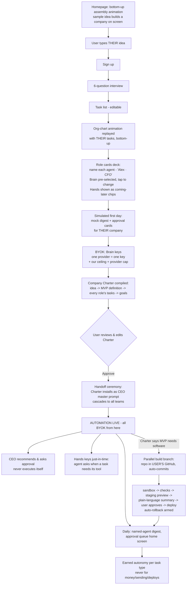

# BYOK Business Autopilot — Userflow v2 (Final)
**Homepage animation → idea → named team → tool choice per role → keys → Company Charter → CEO-led automation → parallel GitHub/deploy**
*Supersedes Part 1 of the previous flow doc. Parts 2–3 (role catalog, key guides) still apply. — July 2026*

---

## What changed from v1, and the four design decisions baked into v2

1. **Platform AI spend ends at the starting line.** Our keys pay ONLY for Stage 1–2 (extraction, org chart, Charter draft, and one simulated preview — a fixed, capped cost of a few cents per signup, treated as CAC). Every real execution call from Stage 4 onward is BYOK. The managed-key trial from v1 is gone; the free value is now the *consulting output* (chart + Charter + preview), not free execution.
2. **Brains vs. Hands.** "Every AI tool" is split into two categories the user experiences differently. A **Brain** is the LLM that does the thinking (Claude, ChatGPT/GPT, Gemini, DeepSeek…) — chosen per role, smart-defaulted. **Hands** are service APIs that DO things (Resend sends email, Higgsfield makes images/video, Codex/Lovable build software, Stripe reads payments…) — attached per sub-agent only when a task needs them, each with its own mini key-guide. Mixing these in one picker would confuse users and the router alike; separating them is what keeps "choose your AI" simple.
3. **Choice with a default, never a blank menu.** Every role card ships with a recommended Brain pre-selected and a one-tap "change" that reveals the full list with plain-language trade-offs. Power users get total freedom; everyone else taps Accept. Choice overload is the #1 killer of non-technical onboarding — the default IS the product opinion.
4. **The Master Prompt becomes a named artifact: the Company Charter.** Idea → MVP definition → every role's tasks → month-one goals, compiled into one reviewable document the user approves and "hands to" their CEO agent. It's the constitutional document of their company — versioned, editable, re-cascaded on every change.

---

## STAGE 0 — Homepage (before signup)

**The animation (30–45s, scroll-triggered, no audio needed).** A sample idea — *"I want to sell handmade candles online"* — types itself into a box. Then, bottom-up, on screen: granular tasks rain down ("send invoices," "answer customers," "post on Instagram," "track wax inventory") → tasks magnetize into clusters → each cluster condenses into named agent cards ("Priya — Invoicing Agent") → cards stack into teams → a role lead card snaps on top of each ("Alex — CFO") → the full org chart assembles → a final frame shows the dashboard with the day's updates and a cost ticker reading *"Today's payroll: $0.11."*
Tagline over the final frame: **"Describe your idea. Meet your company."**
One input box below the animation — the same box from the animation: *"Describe your business idea…"* Typing into it IS the start of onboarding.

---

## STAGE 1 — Idea → Company (platform keys, ~10 min)

**1. Describe the idea** (the homepage box carries the text in). → **Sign up** appears only after they've typed — the idea is the hook, the account is the formality.
**2. Guided interview** — the same 6 questions (business type, who pays, channels, current status, biggest dread, budget), one at a time, tappable.
**3. Task list** — every granular task their idea needs, plain language, editable.
**4. The org-chart animation — replayed for THEIR business.** The exact homepage animation, now with their real tasks assembling into their real teams and roles, bottom-up. This is the shareable magic moment; the marketing asset and the product are the same screen.

## STAGE 2 — Meet the team: naming + Brain choice per role (platform keys, ~5 min)

**5. Role cards, one at a time** (swipeable deck, not a wall). Each card shows:
- **Name** — auto-suggested, fully editable: *"Alex"* — with the role title permanently pinned beneath: **Alex · CFO**. The name never appears without the title (personalization without ambiguity). Names flow through everything downstream: digest ("Alex closed 3 invoices"), approval queue, dashboard.
- **The team** — the sub-agents under this role, each also named ("Priya · Invoicing," "Sam · Expenses").
- **The Brain** — pre-selected recommendation with a one-line reason: *"We recommend Claude for Alex — strongest at careful money-drafting."* Tap **Change** → full Brain list (Claude / ChatGPT / Gemini / DeepSeek / any provider we support) each with a plain trade-off line ("cheapest for high volume," "best for creative copy") and a live per-task cost estimate. Their choice is saved per role; the router's tiering still optimizes within their chosen provider.
- **The Hands** — greyed-out chips showing which service tools this team will ask to connect later ("Priya will ask for Stripe · Maya will ask for Resend"). Informational only at this stage — no setup burden yet.

**6. The simulated first day (the value proof, still on platform keys — generated once, during extraction).** A mock morning digest for their actual company: *"Here's what a Tuesday looks like once your team is live: Alex prepared 2 invoices for your approval · Riko drafted 3 Instagram posts · Priya flagged one late payer…"* with fake approval cards they can tap through. Zero real execution, but the user now *feels* the product before paying anyone anything. Ends on: **"Ready to make it real? Your team needs its work accounts."**

## STAGE 3 — BYOK: Brains first, Hands when needed (~8 min)

**7. Brain key setup.** Grouped by provider — if all roles kept the Claude default, that's ONE key for the whole company (we say so: *"Good news — your whole team runs on one account"*). Each provider gets the split-screen walkthrough (our steps + screenshots left, provider site right — full guides in Part 3 of the companion doc). Paste → live validation → masked fingerprint → Connected.
**8. The safety net (mandatory, 2 taps).** Our monthly ceiling (prefilled from the interview) + guided provider-side spend cap. This is unchanged from v1 and non-negotiable: three independent walls against surprise bills.
**9. Hands keys — deferred and just-in-time.** No service API is requested now. The first time a sub-agent actually needs its tool, its card asks in plain language: *"Maya wants to connect Resend to send your emails — here's how to get that key (2 min)."* Each Hands tool gets its own mini-guide (Resend, Higgsfield, Stripe read-only, GitHub…). Agents whose Hands aren't connected yet work in draft mode automatically. **Rule: never front-load a key the user doesn't need on day one.**

## STAGE 4 — The Company Charter → handed to the CEO (~5 min)

**10. Charter review.** The system compiles everything into one plain-language document: *the idea, sharpened → the MVP definition (what version 1 of this business actually is, scoped to be launchable) → every role and their exact tasks → month-one goals → budget ceilings.* The user reads it, edits anything inline, and approves.
**11. The handoff moment (small ceremony, big retention).** *"Hand the Charter to [CEO name]?"* → Confirm → the Charter installs as the CEO agent's master prompt and cascades through the router to every role lead and team. From this second, the company is live.
- **Guardrail (the CEO is a recommender, not an executor):** the CEO agent synthesizes updates, spots cross-team conflicts, and proposes ("we should raise prices," "Support is drowning — add a canned answer") — but every proposal lands in the approval queue, and only the router dispatches work. The CEO can never spend, send, or deploy anything itself.
- The Charter is versioned. The user can reopen it anytime ("change my goals," "add a task"); every edit re-cascades.

## STAGE 5 — Running: the app becomes the company dashboard

**12. Daily rhythm.** Morning digest, by name: what each agent did, what awaits approval, spend vs. ceiling. The approval queue is the home screen; push notifications are approval requests.
**13. CEO updates & recommendations.** A dedicated CEO card in the digest: weekly synthesis, cross-team flags, and proposals — each with Approve / Modify / Decline. Declines teach it (feedback goes into its context for next time).
**14. Earned autonomy** per task type after N approvals, spot-checked forever, one tap to revoke. Money-moving, external sending, and deploys never earn autonomy.
**15. Dashboard.** Cost per role AND per named sub-agent, autonomy statuses, skip-the-call suggestions, and the monthly "payroll report" — total AI spend vs. what the same work costs on credit-based competitors. From here on, the user's daily experience is exactly what they asked for: **a company dashboard where their employees report every day.**

## STAGE 6 — Parallel branch: when the idea needs software (SaaS/app ideas)

Triggered by the Charter's MVP definition, not by a settings page. If the MVP requires software:
**16. GitHub connect** — one-time Hands setup: a dedicated repo is created in the USER'S GitHub account (their code, theirs forever). Every change the build team proposes is auto-committed — nothing lives only in a chat or a sandbox.
**17. The build pipeline runs parallel to business ops** — Product/Dev team (Spec writer → Build agent → QA → Deploy coordinator) works the software while CFO/CMO/Support run the business. Every change: sandbox → automated checks → staging preview URL → plain-language change summary → **explicit user approval** → production. Auto-rollback armed. The CEO's digest includes build progress alongside business updates: *"Devon shipped the signup page to staging — preview and approve."*

---

## The platform-cost boundary (the line that keeps our margin)

| Phase | Who pays for AI |
|---|---|
| Homepage animation | Nobody — pre-rendered, zero inference |
| Extraction, org chart, simulated day, Charter draft (Stages 1–2, 4) | **Us** — one capped batch of calls per signup, a few cents, booked as CAC |
| Everything from the Charter handoff onward — every task, every CEO synthesis, every build step | **User's own keys.** No exceptions, no invisible platform calls. |

If a signup abandons before BYOK, our total loss is cents — and they still got (and likely shared) an org chart with our name on it.

---

## The v2 flow in one diagram

---

*Companions: `byok-business-autopilot-master-plan.md` (strategy, economics, security) · `byok-userflow-roles-and-api-key-guide.md` Parts 2–3 (role catalog with per-role Brain recommendations, key guides) · `system-architecture-v5-bottomup-teams.mermaid` (system architecture).*
